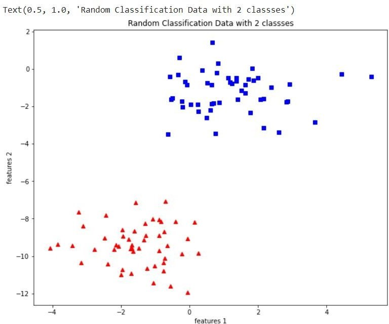

### EX NO: 01
### DATE: 04-04-2022
# <p align="center">RANDOM CLASSIFICATION</p>

## Aim:
To write a python program to perform random classification.

## Equipments Required:
1. Hardware – PCs
2. Anaconda – Python 3.7 Installation / Google Colab /Jupiter Notebook

## Theoritical Concept:

**Random classifier:** It creates a set of decision trees from randomly selected subset of training set. It then aggregates the votes from different decision trees to decide the final class of the test object. Random Forest is suitable for situations when we have a large dataset, and interpretability is not a major concern.

**Purpose of Random classifier:** One of the most important features of the Random Forest Algorithm is that it can handle the data set containing continuous variables as in the case of regression and categorical variables as in the case of classification.


## Algorithm
1. In Random forest n number of random records are taken from the data set having k number of records.

2. Individual decision trees are constructed for each sample.
3. Each decision tree will generate an output.
4. Final output is considered based on Majority Voting or Averaging for Classification and
regression respectively.

## Program:
```python
"""
Program to implement random classification.
Developed by   : MADITHATI YUVATEJA REDDY
RegisterNumber :  212219040069
"""

import matplotlib.pyplot as plt
from sklearn import datasets
X,y = datasets.make_blobs(n_samples=100,n_features=2,centers=2,cluster_std=1.05,random_state=2)
fig = plt.figure(figsize=(10,8))
plt.plot(X[:, 0][y==0], X[:, 1][y==0], 'r^')
plt.plot(X[:, 0][y==1], X[:, 1][y==1], 'bs')
plt.xlabel("feature 1")
plt.ylabel("feature 2")
plt.title("Random Classification Data with 2 classes")
```

## Output:



## Result:
Thus the random classifier was successfully implemented using python programming.
